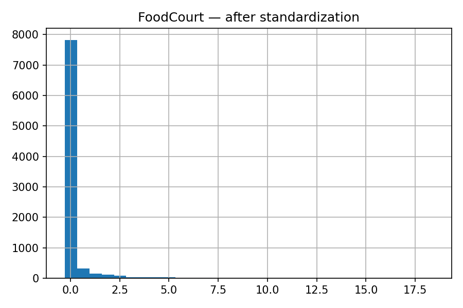

# Activity — Data Preparation and Analysis for Neural Networks

**Author:** Felipe Maluli de Carvalho Dias
**Reproducibility:** All figures are generated by `solution_exercises.py` and saved under `assets/`.

---
### Installation

1. **Clone or navigate to the project directory:**
   ```bash
   cd data-exercise
   ```

2. **Create and activate a virtual environment:**
   ```bash
   python -m venv env
   source env/bin/activate  # On Windows: env\Scripts\activate
   ```

3. **Install dependencies:**
   ```bash
   pip install -r ../../requirements.txt
   ```

4. **Run exercise calculation:**
   ```bash
   python solution_exercises.py
   ```
---

## Exercise 1 — 2D Classification and Separability

**Chosen parameters** (the prompt didn’t specify explicitly):

* 4 classes, 100 samples each;
* Means: C0=(-2, -2), C1=(2, -2), C2=(2, 2), C3=(-2, 2);
* σ = 0.9 (covariance = 0.9²·I).

**2D scatter:**


**Decision regions (MLP with tanh):**


**Analysis:** The four distributions form *blobs* with moderate overlap. A **single linear boundary** cannot separate all classes; a multi-class linear classifier (softmax) would produce **multiple linear frontiers** (one-vs-rest). The (nonlinear) MLP above approximates a polygonal partition adapted to local densities, reducing errors in overlap zones.

---

## Exercise 2 — Nonlinearity in 5D (PCA to 2D)

**Chosen parameters:**

* Class A: μ_A = [0, 0, 0, 0, 0] and Σ_A (5×5) positive definite;
* Class B: μ_B = [0.6, 0.4, -0.6, 0.6, -0.4] and Σ_B ≠ Σ_A (5×5) positive definite.
  Explicit matrices are in the notebook/code.

**PCA projection (5D→2D):**


**Analysis:** Overlap in the 2D projection indicates the structure is **not cleanly linearly separable**, because different covariances imply **quadratic** optimal boundaries (QDA). A **perceptron** would fail; a network with hidden layers + **tanh** activations can approximate the required nonlinear surfaces.

---

## Exercise 3 — Spaceship Titanic (Kaggle) — Preprocessing

**Goal:** `Transported` (binary) indicates whether a passenger was transported to another dimension (positive class).

**Main features and types:**

* Numerical: `Age`, `RoomService`, `FoodCourt`, `ShoppingMall`, `Spa`, `VRDeck`, `CabinNum` (engineered).
* Booleans: `CryoSleep`, `VIP`.
* Categorical: `HomePlanet`, `Destination`, `Deck`, `Side` (derived from `Cabin`).
* Not used in the model: `Name`, `Cabin` (after feature engineering), `PassengerId` (kept only for external reference).

**Missing data handling:**

* Numericals → **median** (robust to outliers).
* Booleans → **mode**.
* Categoricals → **most_frequent** then **One-Hot** (`handle_unknown=ignore`).

**Scaling (tanh-friendly):**

* **Standardization (StandardScaler)**: mean 0, std 1 — appropriate because `tanh` is centered at 0, which speeds up training and reduces initial saturation.

**Histograms before/after:**

|       `Age` before       |       `Age` after       |
| :----------------------: | :---------------------: |
|  |  |

|       `FoodCourt` before       |       `FoodCourt` after       |
| :----------------------------: | :---------------------------: |
|  |  |

**Files ready for modeling:**

* [`X_train_processed.csv`](data/X_train_processed.csv) — processed *features* for training (aligned with `train.csv`).
* [`X_test_processed.csv`](data/X_test_processed.csv) — *features* for test/submission.
* [`preprocessing_feature_names.txt`](data/preprocessing_feature_names.txt) — column names after One-Hot.

---

## AI Use
> AI collaboration was used in this exercise (code + comments + readme).
