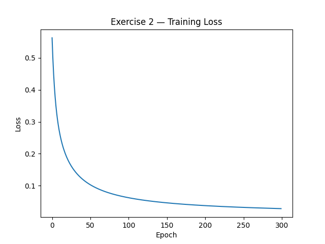
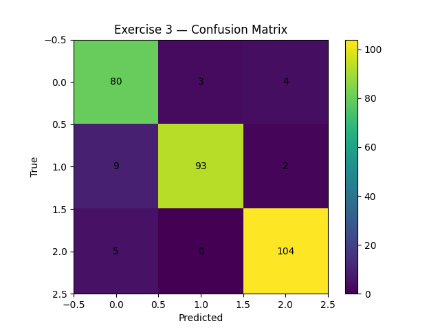
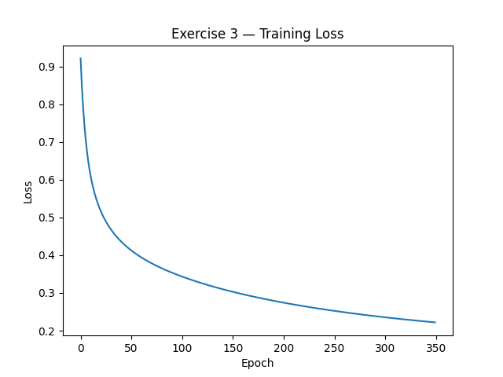
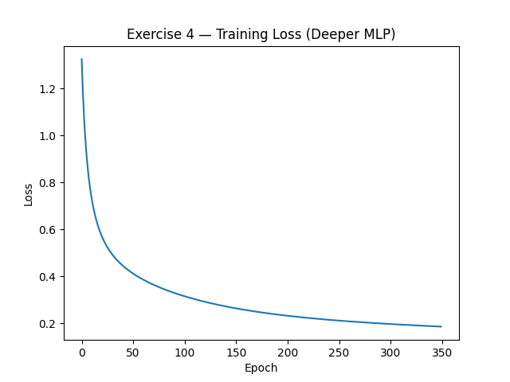

# MLP — Exercises 1–4 (Single Page)

**Author:** Felipe Maluli de Carvalho Dias
**Reproducibility:** All figures are generated by `solution_exercises.py` and saved under `assets/`.

!!! tip "Math Rendering Issue"
    If mathematical equations are not displaying properly, try refreshing the page (Cmd+R or Alt+F5) or reloading the browser tab.

---
### Installation

1. **Clone or navigate to the project directory:**
   ```bash
   cd mlp-exercise
   ```

2. **Create and activate a virtual environment:**
   ```bash
   python -m venv env
   source env/bin/activate  # On Windows: env\Scripts\activate
   ```

3. **Install dependencies:**
   ```bash
   pip install -r ../../requirements.txt
   ```

4. **Run exercise calculation:**
   ```bash
   python solution_exercises.py
   ```
---

## **Exercise 1 — Manual Calculation of MLP Steps**

**Given by Teacher in [Exercise 1](https://insper.github.io/ann-dl/versions/2025.2/exercises/mlp/#exercise-1-manual-calculation-of-mlp-steps):**

$$x=\begin{bmatrix}0.5\\-0.2\end{bmatrix}, \quad y=1.0$$

$$W^{(1)}=\begin{bmatrix}0.3&-0.1\\0.2&0.4\end{bmatrix}, \quad b^{(1)}=\begin{bmatrix}0.1\\-0.2\end{bmatrix}$$

$$W^{(2)}=\begin{bmatrix}0.5&-0.3\end{bmatrix}, \quad b^{(2)}=0.2$$

$$\text{Activation: } \tanh$$

### 1) **Forward pass**
Hidden pre‑activations:

$$z^{(1)} = W^{(1)}x + b^{(1)}$$

$$= \begin{bmatrix}0.3&-0.1\\0.2&0.4\end{bmatrix} \begin{bmatrix}0.5\\-0.2\end{bmatrix} + \begin{bmatrix}0.1\\-0.2\end{bmatrix}$$

$$= \begin{bmatrix}0.3\cdot0.5 + (-0.1)\cdot(-0.2) \\ 0.2\cdot0.5 + 0.4\cdot(-0.2)\end{bmatrix} + \begin{bmatrix}0.1\\-0.2\end{bmatrix}$$

$$= \begin{bmatrix}0.27\\0.02\end{bmatrix} + \begin{bmatrix}0.1\\-0.2\end{bmatrix}$$

$$= \boxed{\begin{bmatrix}0.270000\\-0.180000\end{bmatrix}}$$

Hidden activations (\(\tanh\) element‑wise):

$$h^{(1)} = \tanh\!\left(z^{(1)}\right)$$

$$= \boxed{\begin{bmatrix}0.263625\\-0.178081\end{bmatrix}}$$

Output pre‑activation and final output:

$$u^{(2)} = W^{(2)}h^{(1)} + b^{(2)}$$

$$= \begin{bmatrix}0.5&-0.3\end{bmatrix} \begin{bmatrix}0.263625\\-0.178081\end{bmatrix} + 0.2$$

$$= \boxed{0.385237}$$

$$\hat y = \tanh(u^{(2)}) = \boxed{0.367247}$$

### 2) **Loss (MSE)**
With one sample,
$$
L = (y - \hat y)^2 = (1 - 0.367247)^2 = \boxed{0.40037691}.
$$

### 3) **Backward pass — full gradients**
Start with

$$\frac{\partial L}{\partial \hat y} = 2(\hat y-y) = \boxed{-1.265507}$$

$$\frac{\partial \hat y}{\partial u^{(2)}} = 1-\tanh^2(u^{(2)}) = \boxed{0.865130}$$

$$\Rightarrow \quad \frac{\partial L}{\partial u^{(2)}} = \boxed{-1.094828}$$

**Output layer:**

$$\frac{\partial L}{\partial W^{(2)}} = \frac{\partial L}{\partial u^{(2)}} \cdot h^{(1)}$$

$$= \boxed{\begin{bmatrix}-0.288624&0.194968\end{bmatrix}}$$

$$\frac{\partial L}{\partial b^{(2)}} = \boxed{-1.094828}$$

**Hidden layer:** propagate through \(\tanh\)

$$\frac{\partial L}{\partial h^{(1)}} = \frac{\partial L}{\partial u^{(2)}} \cdot W^{(2)\top}$$

$$= \boxed{\begin{bmatrix}-0.547414\\0.328448\end{bmatrix}}$$

$$\frac{\partial h^{(1)}}{\partial z^{(1)}} = 1-\tanh^2(z^{(1)})$$

Hence

$$\frac{\partial L}{\partial z^{(1)}} = \frac{\partial L}{\partial h^{(1)}} \odot \big(1-\tanh^2(z^{(1)})\big)$$

$$= \boxed{\begin{bmatrix}-0.509370\\0.318032\end{bmatrix}}$$

Gradients for the first layer parameters:

$$\frac{\partial L}{\partial W^{(1)}} = \frac{\partial L}{\partial z^{(1)}} \cdot x^\top$$

$$= \boxed{\begin{bmatrix}
-0.254685&0.101874\\
0.159016&-0.063606
\end{bmatrix}}$$

$$\frac{\partial L}{\partial b^{(1)}} = \boxed{\begin{bmatrix}-0.509370\\0.318032\end{bmatrix}}$$

### 4) **One gradient-descent update** (Step 4 uses $\eta=0.1$)

Update rule (inline): $\theta \leftarrow \theta - \eta\,\nabla_\theta L$

Display form:

$$
\theta \leftarrow \theta - \eta\,\nabla_\theta L
$$

$$W^{(2)}_\text{new} = W^{(2)} - 0.1 \cdot \frac{\partial L}{\partial W^{(2)}}$$

$$= \boxed{\begin{bmatrix}0.528862&-0.319497\end{bmatrix}}$$

$$b^{(2)}_\text{new} = \boxed{0.309483}$$

For the first layer,

$$W^{(1)}_\text{new} = W^{(1)} - 0.1 \cdot \frac{\partial L}{\partial W^{(1)}}$$

$$= \boxed{\begin{bmatrix}
0.325468&-0.110187\\
0.184098&0.406361
\end{bmatrix}}$$

$$b^{(1)}_\text{new} = \boxed{\begin{bmatrix}0.150937\\-0.231803\end{bmatrix}}$$

> Per the submission requirements, all intermediate calculations (matrix multiplications, tanh applications, full gradient derivations) have been shown with up to least 4 decimals.

---

## **Exercise 2 — Binary classification with `make_classification`**

- **Data**: 1000 samples, 2 features, 2 classes; to achieve **1 cluster for class 0** and **2 clusters for class 1**, we generate **class‑specific subsets** with different `n_clusters_per_class` and combine them before the 80/20 split.  
- **MLP (from scratch):** `2 → 10 → 1`, tanh → sigmoid, BCE, full‑batch GD.  
- **Result:** Test accuracy **97.50%**; training curve saved to `assets/ex2_loss.png`.




---

## **Exercise 3 — 3‑Class with exact code reuse**

- **Data**: 1500 samples, 4 features, classes=3 with clusters per class = [2,3,4]; generate per‑class subsets and combine; 80/20 split.  
- **MLP:** *exact same* `MLP` class and training loop as Exercise 2, with output size 3 and softmax+CCE; architecture `4 → 16 → 3`.  
- **Result:** Test accuracy **92.33%**; see `assets/ex3_loss.png` and `assets/ex3_confusion.png`.






---

## **Exercise 4 — Deeper MLP (≥2 hidden layers)**

- **Architecture**: `4 → 24 → 12 → 3` (tanh, tanh, softmax).  
- **Result:** Test accuracy **92.00%**; curve at `assets/ex4_loss.png`.



---

## AI Use
> AI collaboration was used in this exercise (code + readme). Also, the latex code was generated with AI (I do not know how to write latex).