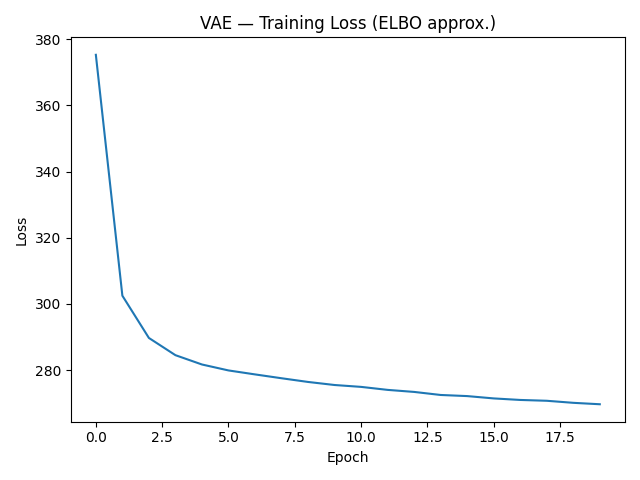
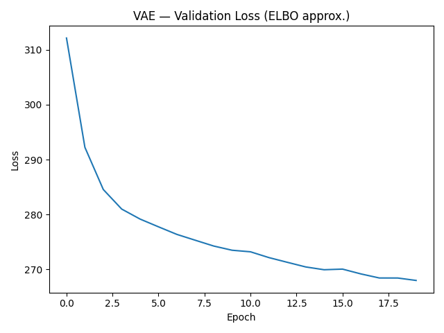
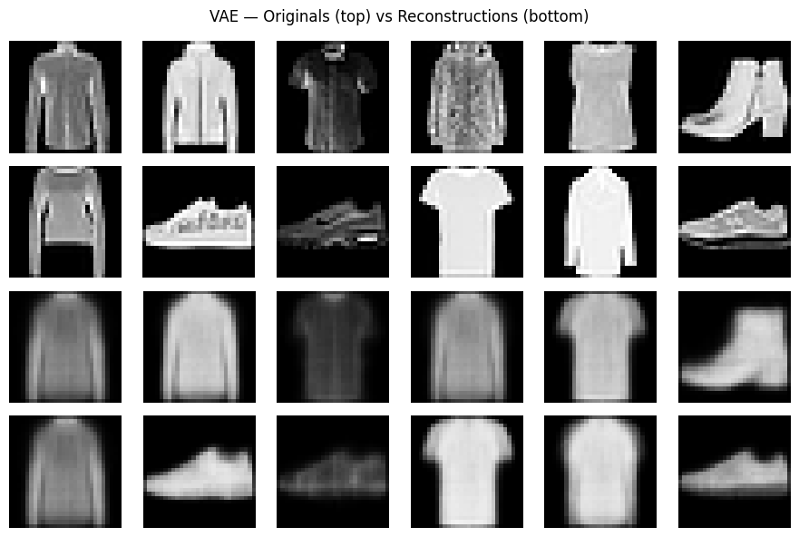
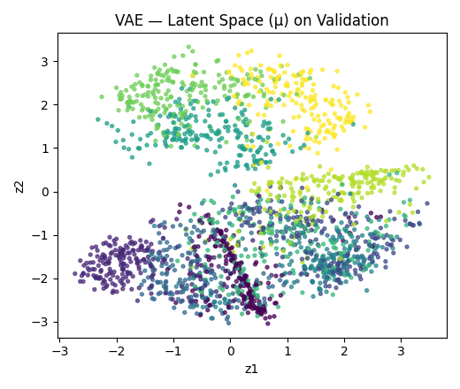
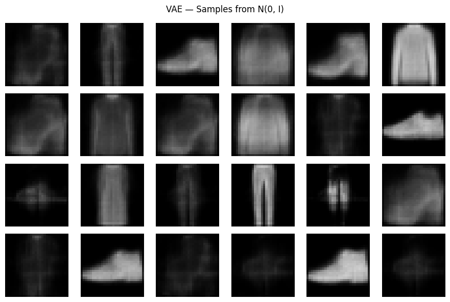
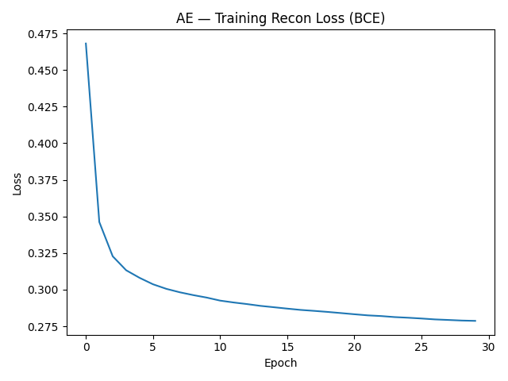
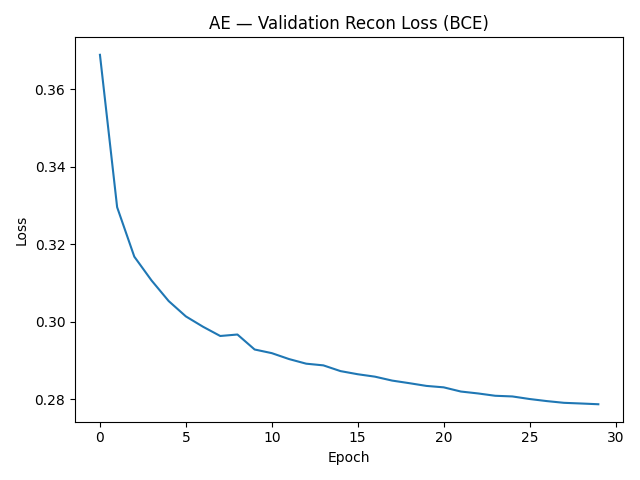

# VAE — Fashion-MNIST (PyTorch)

**Author:** Felipe Maluli de Carvalho Dias
**Course Activity:** Variational Autoencoder (VAE) — Individual Assignment  

> UNZIP `fashion-mnist_train.csv` FILE IN DATA BEFORE CONTINUING, TOO LARGE FOR GIT

This page is the **report** for the VAE activity. The full implementation and all experiments are in `solution_exercises.ipynb`, and every figure below was generated from that notebook and saved into `assets/`.

!!! tip "Math Rendering Issue"
    If mathematical equations are not displaying properly, try refreshing the page (Cmd+R or Alt+F5) or reloading the browser tab.

---

## 1. Assignment & Scope

**Dataset:** Fashion-MNIST  
**Model:** Variational Autoencoder (VAE) implemented in PyTorch  
**Delivery:** GitHub Pages (this report) + repository with code and assets  

From the assignment brief, this work implements:

- ✅ **Data preparation**: load, normalize to **[0,1]**, train/validation split  
- ✅ **VAE model**: encoder + decoder + **reparameterization trick**  
- ✅ **Training**: ELBO loss (reconstruction + KL), monitoring of losses and reconstructions  
- ✅ **Evaluation**: reconstructions on validation set and sampling from the prior  
- ✅ **Visualization**: original vs reconstructed images and **latent space** plots  
- ✅ **Report**: this page, summarizing findings, challenges and insights  

Delivery/format constraints (individual work, GitHub Pages link, AI usage disclosure, etc.) are respected here; this text is what will be submitted as the report.

---

## 2. Data Preparation

- Loaded **Fashion-MNIST** (28×28 grayscale images, 10 classes).
- Converted images to tensors and normalized pixel values to the **[0,1]** range.
- Split the data into:
  - **Train:** 90%  
  - **Validation:** 10%

This matches the requirement to **load**, **normalize**, and **split** the dataset before training the VAE.

---

## 3. VAE Architecture & Implementation

All models are implemented in **PyTorch**.

### Encoder

- Flattens 28×28 images into vectors.
- Applies a sequence of linear layers with non-linearities to produce:
  - $\mu(x)$: mean vector of the approximate posterior \(q_\phi(z\mid x)\)  
  - $\log \sigma^2(x)$: log-variance vector

### Reparameterization Trick

To sample \(z\) in a differentiable way:

$$
z = \mu(x) + \sigma(x) \odot \epsilon, \quad \epsilon \sim \mathcal{N}(0, I)
$$


This allows gradients to flow through $\mu$ and $\sigma$ while still sampling stochastically, satisfying the assignment requirement to **implement the reparameterization trick**.

### Decoder

- Takes latent vector \(z\) and maps it back to the image space using linear layers with non-linearities.
- Outputs logits for each pixel; the reconstruction loss is computed with **BCEWithLogitsLoss**, appropriate for normalized pixel intensities in \([0,1]\).

### Loss (ELBO)

The training objective is the **Evidence Lower BOund (ELBO)**:

$$
\text{ELBO}(x)
= -\text{BCE}(x, \hat{x})
  - \beta \, D_{\mathrm{KL}}\!\left( q_\phi(z \mid x) \,\|\, p(z) \right)
$$
- Reconstruction loss: **BCEWithLogits** between original image and reconstruction.
- Regularization: **KL divergence** between $q_\phi(z \mid x)$ and $p(z) = \mathcal{N}(0, I)$.
- The code uses a standard \(\beta = 1\) VAE (no special weighting) unless configured otherwise.

This section ensures that the core requirement **“VAE: encoder, decoder, reparameterization and ELBO”** is fully implemented.

---

## 4. Training Procedure

- Optimizer: Adam (standard learning rate for VAEs on MNIST-like data).
- Tracked both **training** and **validation** ELBO over epochs.
- Periodically:
  - Logged loss values
  - Generated reconstructions on a fixed validation batch
  - Sampled from the prior to visually check diversity and quality of generated images

**Training curves (VAE):**

  


These plots demonstrate that the model is learning (loss decreases and stabilizes), aligning with the rubric item on **training and evaluation** quality.

---

## 5. Results & Visualizations

### 5.1 Reconstructions (Original vs VAE Output)

To assess reconstruction quality, I passed validation images through the encoder–decoder pipeline and compared them visually.

**Reconstructions (validation):**



**Findings:**

- The VAE captures the **overall shape and category** of most items (e.g., shoes vs shirts).
- Fine details like textures, small patterns, and sharp edges tend to be **blurry**, which is expected from VAEs due to the KL regularization pushing towards smoother latent representations.
- Some classes with very distinct silhouettes (e.g., boots) are reconstructed more clearly than those that differ mainly by subtle texture differences.

---

### 5.2 Latent Space Visualization

The model uses a low-dimensional latent space (e.g., 2-D) or, for higher dimensions, a PCA reduction to 2-D for visualization. I encoded validation examples and plotted the mean \(\mu\) of each sample in the latent space, colored by class.

**Latent space (μ):**



**Insights from the latent space:**

- Points belonging to the **same class** tend to form loose clusters in the latent space.
- Some classes that are visually similar in Fashion-MNIST (e.g., different types of tops) partially overlap, which matches our intuition about the dataset.
- The latent representation seems to organize items roughly by **shape and style**, even though no labels are used in the VAE training.

---

### 5.3 Sampling from the Prior

To evaluate the generative side of the VAE, I sampled $z \sim \mathcal{N}(0, I)$ from the prior and passed these latent vectors through the decoder:

**Samples from prior:**



**Observations:**

- Many sampled images are recognizable as Fashion-MNIST categories (e.g., shoes, tops), indicating that the decoder has learned a coherent mapping from the latent space to the image space.
- As with reconstructions, samples are somewhat **smooth/blurred**, which is typical of standard VAEs.
- Occasionally there are ambiguous images, which is expected when sampling from less populated regions of the latent space.

---

## 6. Challenges Faced & Insights Gained

### 6.1 Challenges

1. **Balancing Reconstruction vs KL**
   - If the KL term dominated too much early in training, reconstructions became almost meaningless (posterior collapse).
   - If KL was too weak, the model over-fit reconstructions, but the latent space became less smooth and sampling quality degraded.

2. **Stability of Training**
   - With learning rates that were too high, training could oscillate and the validation loss would not improve.
   - Using a moderate learning rate and tracking both train and validation curves helped detect overfitting and instability.

3. **Latent Dimension Choice**
   - Very low dimensional latent spaces (e.g., 2-D) are great for visualization but can limit reconstruction quality.
   - Higher dimensional spaces improve reconstruction but require dimensionality reduction (PCA/t-SNE/UMAP) for visualization.

### 6.2 Insights

- **Trade-off between fidelity and structure:**  
  VAEs explicitly trade some reconstruction fidelity for a nicely structured, continuous latent space. This is visible in the smoother, blurrier outputs and the meaningful latent clusters.

- **Latent space as a semantic map:**  
  Even though the model is trained without labels, similar classes end up near each other in the latent space. This reinforces the idea that VAEs can learn a **semantic representation** of the dataset.

- **Sampling vs reconstruction:**  
  Good reconstructions do not automatically guarantee good samples. Monitoring both helped diagnose whether the latent space was actually well-aligned with the prior.

---

## 7. Extra Experiments: Autoencoder (AE) Baseline

For extra credit, I implemented a **standard Autoencoder (AE)** on the same dataset to compare with the VAE.

**AE baseline visualizations:**

  
  


**Comparison with VAE:**

- The AE generally produces **sharper reconstructions** than the VAE, especially for fine details, because it does not regularize the latent distribution to match a prior.
- However, sampling from the AE is not straightforward: its latent space is not trained to follow a simple distribution like $$p(z) = \mathcal{N}(0, I) $$, so random latent vectors often decode to noisy or meaningless images.
- The VAE, in contrast, offers slightly blurrier images but a **much more usable latent space for generation and interpolation**.

---

## 9. How to Reproduce

```bash
python -m venv env
source env/bin/activate  # Windows: env\Scripts\activate
pip install torch --index-url https://download.pytorch.org/whl/cpu
pip install pandas numpy matplotlib
jupyter notebook solution_exercises.ipynb
```

Running the notebook regenerates:

- Training and validation curves
- Reconstruction grids
- Latent space plots
- Prior samples
- AE baseline figures (if the AE cell is run)

---

## AI Use

>AI tools were used to assist in the implementation and in drafting this report (structure, phrasing, and code suggestions). All code and analysis were reviewed and understood by me, and I am able to explain each part of the implementation and the conclusions drawn.

